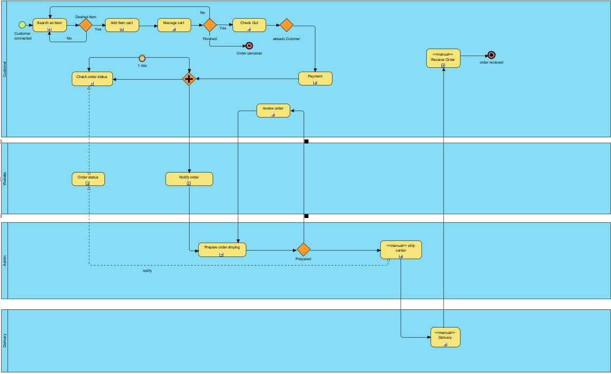

# Modern-Ecommerce-Platforms
Design and Develop Modern Ecommerce Plafform

# Abstract

The project features the development and launch of Shark, an innovative e-commerce platform for resale branded products.  The platform leverages WordPress and WooCommerce, providing users with an intuitive and secure online marketplace experience. Shark aims to bridge the gap between luxury and sustainability with certified pre-owned products from certified designers.  correctness  Users can explore, buy and sell their beloved luxury properties.  This project emphasizes strict validation procedures.  Quality Assurance  and a seamless user experience to build trust among customers. Shark also offers Business Process Visualization and Notation (BPMN), which describes the complex processes that underpin website functionality. Shark represents an exciting opportunity.  In redefining the luxury resale market  At the same time supporting sustainable consumption.

# Introduction

Today, I'm excited to introduce you to our innovative and easy-to-use platform. It has changed the way we shop and do business. shark in this presentation We will explore the world of e-commerce. Dive deeper into shark's features and benefits and understand how it's shaping digital shopping.

# Software and Tools Used

1. Laragon: Laragon is utilized as our local development environment, providing a convenient platform for building and testing the Shark E-Commerce Website before deployment.

2. WordPress: WordPress serves as the primary content management system (CMS) for our website, offering a flexible and user-friendly environment for managing web content.

2. WooCommerce: WooCommerce is integrated seamlessly with WordPress, empowering our website with e-commerce capabilities, including product management, shopping cart functionality, and secure payment processing.

3. PDF Invoices & Packing Slips for WooCommerce: PDF Invoices & Packing Slips for WooCommerce is responsible for generating professional invoices and packing slips for customer orders, ensuring a smooth and professional shopping experience.

4. Akismet Anti-Spam: Spam Protection is Used by millions, Akismet is quite possibly the best way in the world to protect your blog from spam. It keeps your site protected even while you sleep. To get started, just go to your Akismet Settings page to set up your API key.

# digital store

## Overview 

Digital websites or online stores allow people to sell products or services through the internet through online channels and can purchase them. Products from your device conveniently and are available in digital stores as follows.

### Home page
Every journey begins with a step. And in the digital world, that starts with visiting a website. We'll explore how Shark manages its digital storefront to provide a user experience designed to effectively showcase products or services. This includes a clear navigation menu, search functionality and a visually appealing layout.

### Shop page
The heart of any digital store is the product catalog. This catalog lists all available products. Includes detailed description, price, high quality images. and related product formats (e.g. size, color)

### Cart
Users can add products to their virtual shopping cart while continuing to browse the store. The shopping cart holds the selected products until the customer is ready to proceed with checkout.

### Checkout
Involves entering shipping information Selecting the desired shipping method and order confirmation It also includes payment processing and order verification.

# BPMN Diagram

BPMN is summarized from the Business Process Model and Notation. It is a standard and direction for displaying business information (Business Process Model). It is a part that must explain work to the general public, not just computer scientists or people learning about IT. Come especially understand

This BPMN diagram shows the flow of my ecommerce website. To make it easy for the general public to understand

# All Pools in BPMN

- Customer

- Website

- Admin

- Delivery

### Customer

Shows the customer's process for using the platform.

####  Browsing and Searching:
Customers search for products or services they are interested in. They can browse through categories, use search filters, or enter specific keywords to find what they want.

#### Product Selection:
After finding a product, customers click on it to view detailed information, including product descriptions, images, prices, and customer reviews. They may also compare products before making a selection.

#### Adding to Cart:
Customers can add selected items to their shopping cart. The cart allows them to review and modify their selections before proceeding to checkout.

#### Checkout Process:
This is a critical step in the e-commerce process:
Shipping Information: Customers provide shipping details, including the delivery address and preferred shipping method.
Payment: Customers choose a payment method (e.g., credit card, PayPal, Apple Pay) and enter their payment information.
Promo Codes/Coupons: If applicable, customers may enter promo codes or coupons for discounts.
Review Order: Customers review their order, including the total cost, before finalizing the purchase.

#### Payment Authorization:
The platform verifies the payment information and authorizes the transaction. If successful, the customer receives an order confirmation.

#### Order Confirmation:
The platform provides an order confirmation page and sends an email confirming the purchase. This email typically includes order details, estimated delivery times, and a receipt.

#### Tracking and Notifications:
Customers can track the status of their order through the platform. They may receive email or SMS notifications about order updates, shipping progress, and estimated delivery times.

### Website

#### Order Processing and Fulfillment:
Receive and process incoming orders from customers.
Generate shipping labels and provide tracking information to customers.

#### Inventory Management:
Monitor inventory levels in real-time and reorder products as they run low.
Update product availability status to prevent overselling.

#### Content Management:
Continuously update product listings, descriptions, and images to reflect the latest inventory and prices.
Add new products and remove discontinued ones.
Manage other content such as blog posts, FAQs, and user-generated content.

### Admin

### Delivery

