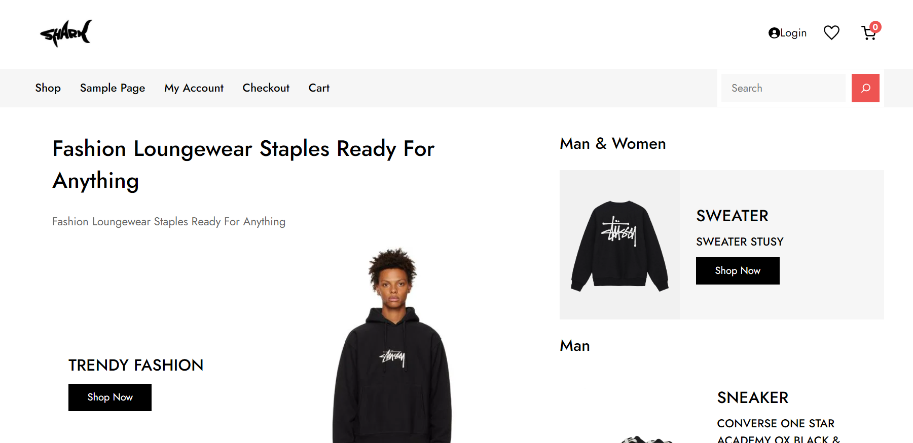

# Modern-Ecommerce-Platforms
Design and Develop Modern Ecommerce Plafform

# Abstract

The project features the development and launch of Shark, an innovative e-commerce platform for resale branded products.  The platform leverages WordPress and WooCommerce, providing users with an intuitive and secure online marketplace experience. Shark aims to bridge the gap between luxury and sustainability with certified pre-owned products from certified designers.  correctness  Users can explore, buy and sell their beloved luxury properties.  This project emphasizes strict validation procedures.  Quality Assurance  and a seamless user experience to build trust among customers. Shark also offers Business Process Visualization and Notation (BPMN), which describes the complex processes that underpin website functionality. Shark represents an exciting opportunity.  In redefining the luxury resale market  At the same time supporting sustainable consumption.

# Introduction

Today, I'm excited to introduce you to our innovative and easy-to-use platform. It has changed the way we shop and do business. shark in this presentation We will explore the world of e-commerce. Dive deeper into shark's features and benefits and understand how it's shaping digital shopping.

# Software and Tools Used

1. Laragon: Laragon is utilized as our local development environment, providing a convenient platform for building and testing the Boo Shop E-Commerce Website before deployment.

2. WordPress: WordPress serves as the primary content management system (CMS) for our website, offering a flexible and user-friendly environment for managing web content.

2. WooCommerce: WooCommerce is integrated seamlessly with WordPress, empowering our website with e-commerce capabilities, including product management, shopping cart functionality, and secure payment processing.

3. PDF Invoices & Packing Slips for WooCommerce: PDF Invoices & Packing Slips for WooCommerce is responsible for generating professional invoices and packing slips for customer orders, ensuring a smooth and professional shopping experience.

4. Akismet Anti-Spam: Spam Protection is Used by millions, Akismet is quite possibly the best way in the world to protect your blog from spam. It keeps your site protected even while you sleep. To get started, just go to your Akismet Settings page to set up your API key.

# digital storefront

Every journey begins with a step. And in the digital world, that starts with visiting a website. We'll explore how shark manages its digital storefront to deliver a visually appealing and user-friendly experience.

# Browsing and selecting

Browsing online will lead you to the list you want.
## Shop page

# BPMN Diagram

![home one]

